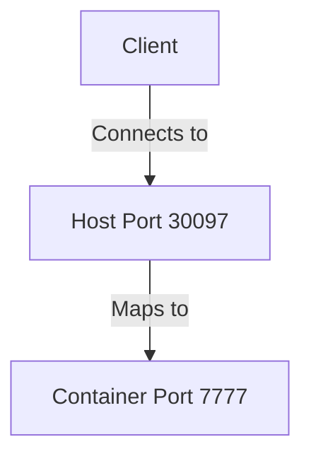

# ODIN Fleet Platform

Global game server deployment and management platform optimized for real-time, stateful hosting (world-building games) and versatile for short-term, stateless tasks (match-based games).

## Architecture Overview

```
Images → Server Configs → Deployments → Servers
   ↓           ↓              ↓            ↓
Docker/     Resources,      Location,    Running
Steam       Ports, Env     Instances    Instances
```

### Core Layers

**1. Images (Binary)**
- Docker container or Steamworks build
- Versioned snapshots of server software
- Supports: Docker Hub, GitHub/GitLab/AWS/Azure/GCP registries, Steamworks

**2. Server Configurations**
- Blueprint defining how to run an image
- Resources: CPU, memory limits/reservations
- Ports: TCP/UDP, dynamic mapping
- Environment variables: static, system, port-based
- Persistent storage: mounted volumes
- Config/secret files
- Restart policies

**3. Deployments**
- Defines WHERE and HOW MANY instances run
- Location constraints: country, city
- Instance count for scaling
- Links to a server configuration

**4. Servers (Instances)**
- Individual running containers
- Unique IP:Port combinations
- Real-time stats and logs
- Lifecycle management

## Key Concepts

### Image Types

**Docker Images:**
```typescript
{
  name: "GameServer",
  version: "1.0.0",
  type: "dockerImage",
  os: "linux" | "windows",
  dockerImage: {
    imageName: "myregistry/gameserver:1.0.0",
    registryId: 123  // Registry ID from Fleet
  }
}
```

**Steamworks Images:**
```typescript
{
  name: "GameServer",
  version: "1.0.0",
  type: "steam",
  os: "windows" | "linux",
  steamworks: {
    appId: 123456,
    branch: "public",
    executable: "/gameserver/server.exe",
    username: "steamuser",
    password: "steampass"
  }
}
```

**Important:** Steamworks files are stored at `/gameserver` path in container.

### Port Configuration

Ports are dynamically mapped from container to host:



**Port Definition:**
```typescript
{
  ports: [
    {
      name: "Game Port",
      targetPort: 7777,      // Internal container port
      protocols: ["UDP"],     // TCP, UDP, or both
      publishMode: "ingress"
    }
  ]
}
```

**Accessing Published Ports:**
Use dynamic environment variables to get the actual published port:
```typescript
{
  env: [
    {
      key: "GAME_PORT",
      type: "portMapping",
      value: "Game Port"  // References port name
    }
  ]
}
```

Inside the container, `GAME_PORT` will contain the actual published port (e.g., 30097).

### Environment Variables

**Three Types:**

1. **Static:** Fixed values
```typescript
{
  key: "SERVER_NAME",
  type: "static",
  value: "My Production Server"
}
```

2. **System:** Runtime values
```typescript
{
  key: "SERVER_IP",
  type: "system",
  value: "IP-Address"  // or "Instance-ID"
}
```

3. **Port Mapping:** Published port numbers
```typescript
{
  key: "GAME_PORT",
  type: "portMapping",
  value: "Game Port"  // Port definition name
}
```

### Resource Management

```typescript
{
  resources: {
    limits: {
      cpu: 2,        // Maximum CPU cores
      memory: 4096   // Maximum memory in MB
    },
    reservations: {
      cpu: 1,        // Minimum guaranteed CPU
      memory: 2048   // Minimum guaranteed memory
    }
  }
}
```

**Resource Types:**
- **Shared:** Cost-effective, potential "noisy neighbor" effect
- **Dedicated:** Reserved resources, higher reliability, higher cost

### Persistent Storage

```typescript
{
  mounts: [
    {
      target: "/data",        // Path in container
      readOnly: false
    },
    {
      target: "/logs",
      readOnly: false
    }
  ]
}
```

Data in mounted volumes survives restarts and is automatically backed up/restored.

### Restart Policies

```typescript
{
  restartPolicy: {
    condition: "any" | "on-failure" | "never"
  }
}
```

- **Never:** Manual restart only
- **On Failure:** Restart on non-zero exit code
- **Always:** Always restart (recommended for production)

## Node.js SDK

### Installation

```bash
npm install @4players/fleet-nodejs
```

### Basic Usage

```typescript
import { FleetApiClient } from '@4players/fleet-nodejs';

const client = new FleetApiClient("YOUR_API_TOKEN");
client.selectAppId(appId);

// Create Docker image
const image = await client.createBinary({
  name: "GameServer",
  version: "1.0.0",
  type: "dockerImage",
  os: "linux",
  appId: appId,
  dockerImage: {
    imageName: "myregistry/server:1.0.0",
    registryId: registryId
  }
});

// Create server configuration
const config = await client.createServerConfig({
  name: "Production Config",
  binaryId: image.id,
  resources: {
    limits: { cpu: 2, memory: 4096 },
    reservations: { cpu: 1, memory: 2048 }
  },
  ports: [
    {
      name: "Game Port",
      targetPort: 7777,
      protocols: ["UDP"],
      publishMode: "ingress"
    }
  ],
  env: [
    { key: "SERVER_NAME", type: "static", value: "Production" },
    { key: "GAME_PORT", type: "portMapping", value: "Game Port" }
  ],
  mounts: [{ target: "/data", readOnly: false }],
  restartPolicy: { condition: "any" }
});

// Create deployment
const locations = await client.getLocations();
const germanyLocation = locations.data.find(loc => loc.country === 'de');

const deployment = await client.createDeployment({
  name: "EU Production",
  serverConfigId: config.id,
  numInstances: 3,
  placement: {
    constraints: {
      country: germanyLocation.country,
      city: germanyLocation.city
    }
  }
});

// List running servers
const servers = await client.getServers();
for (let server of servers) {
  const gamePort = server.ports["Game Port"]?.publishedPort;
  const ip = server.addr;
  console.log(`Server ${server.id}: ${ip}:${gamePort}`);
}
```

### Server Metadata Management

Update server metadata for matchmaking/server browser integration:

```typescript
// Update server metadata (useful for matchmaking)
await client.updateServerMetadata(serverId, {
  instance_state: "occupied",  // or "idle"
  game_mode: "deathmatch",
  player_count: 8,
  max_players: 16,
  map_name: "de_dust2"
});
```

## REST API

**Base URL:** `https://fleet.4players.io`

**Authentication:**
```
Authorization: Bearer YOUR_API_TOKEN
```

**Key Endpoints:**
- `GET /apps/{appId}/binaries` - List images
- `POST /apps/{appId}/binaries` - Create image
- `GET /apps/{appId}/server-configs` - List configs
- `POST /apps/{appId}/server-configs` - Create config
- `GET /apps/{appId}/deployments` - List deployments
- `POST /apps/{appId}/deployments` - Create deployment
- `GET /apps/{appId}/servers` - List servers
- `GET /apps/{appId}/servers/{serverId}` - Get server details
- `PATCH /apps/{appId}/servers/{serverId}/metadata` - Update metadata
- `GET /apps/{appId}/servers/{serverId}/logs` - Get logs

Full API docs: [https://fleet.4players.io/docs/api](https://fleet.4players.io/docs/api)

## Matchmaking Integration Patterns

### AWS GameLift FlexMatch Integration

ODIN Fleet integrates with GameLift Anywhere + FlexMatch for robust matchmaking:

**Architecture:**
1. Game clients request matches via backend service
2. Backend calls AWS `StartMatchmaking` → receives ticketId
3. AWS FlexMatch searches for players based on ruleset
4. SNS notifications sent to backend on match events
5. Backend updates game client via database/WebSocket
6. Matched players connect to ODIN Fleet server

**Key Components:**

**Backend Service (Node.js/Firebase):**
```javascript
// Start matchmaking
exports.StartFlexMatch = onRequest(async (req, res) => {
  const input = {
    ConfigurationName: req.body.Config,
    Players: req.body.PlayerData
  };
  const command = new StartMatchmakingCommand(input);
  const response = await gameLiftClient.send(command);
  res.status(200).send(response);  // Returns ticketId
});

// SNS notification endpoint
exports.MatchmakingNotification = onRequest(async (req, res) => {
  const message = JSON.parse(req.body.Message);
  const detail = message.detail;

  switch (detail.type) {
    case "MatchmakingSucceeded":
      // Update database with connection info
      await updateTicket(detail.ticketId, {
        status: "COMPLETED",
        ipAddress: detail.gameSessionInfo.ipAddress,
        port: detail.gameSessionInfo.port
      });
      break;

    case "MatchmakingTimedOut":
      await updateTicket(detail.ticketId, { status: "TIMEOUT" });
      break;
  }
  res.status(200).send("ok");
});
```

**AWS Configuration:**
- Create SNS topic for notifications
- Create placement queue targeting ODIN Fleet
- Create matchmaking ruleset with custom rules
- Create matchmaking configuration linking to queue

**FlexMatch Ruleset Example:**
```json
{
  "name": "SkillBasedRuleset",
  "ruleLanguageVersion": "1.0",
  "playerAttributes": [
    { "name": "skill", "type": "number", "default": 1000 },
    { "name": "gamemode", "type": "string" }
  ],
  "teams": [
    { "name": "players", "minPlayers": 2, "maxPlayers": 8 }
  ],
  "rules": [
    {
      "name": "SameGameMode",
      "type": "comparison",
      "operation": "=",
      "measurements": ["flatten(teams[*].players.attributes[gamemode])"]
    },
    {
      "name": "SkillRange",
      "type": "batchDistance",
      "batchAttribute": "skill",
      "maxDistance": 200
    }
  ]
}
```

**Game Client Flow:**
```typescript
// 1. Start matchmaking
const response = await backendService.startMatchmaking({
  playerId: "player-123",
  skill: 1200,
  gamemode: "deathmatch"
});
const ticketId = response.ticketId;

// 2. Poll for status updates
setInterval(async () => {
  const status = await backendService.checkTicket(ticketId);

  if (status.status === "COMPLETED") {
    // Connect to server
    connectToServer(status.ipAddress, status.port);
  }
}, 2000);
```

### Nakama Fleet Manager Integration

ODIN Fleet integrates as a fleet provider for Nakama matchmaking:

**Key Concept:** Nakama discovers ODIN servers via metadata filtering.

**Server Metadata Schema:**
```json
{
  "instance_state": "idle",  // or "occupied"
  "game_port": 7777,
  "game_mode": "deathmatch",
  "player_count": 0,
  "max_players": 16
}
```

**Nakama Module Registration:**
```go
func InitModule(ctx context.Context, logger runtime.Logger, db *sql.DB,
                nk runtime.NakamaModule, initializer runtime.Initializer) error {

    appID, _ := strconv.Atoi(os.Getenv("ODIN_APP_ID"))
    apiToken := os.Getenv("ODIN_API_TOKEN")

    cfg := odinfleet.GetDefaultConfiguration(int32(appID), apiToken)
    fm, err := odinfleet.CreateOdinFleetManager(logger, cfg,
                                                 odinfleet.ServerToInstanceInfo)

    initializer.RegisterFleetManager(fm)
    logger.Info("ODIN fleet manager registered")
    return nil
}
```

**Fleet Manager Implementation:**
```go
// List available servers (filters by metadata)
func (fm OdinFleetManager) List(ctx context.Context, query string,
                                 limit int, previousCursor string) (
    instances []*runtime.InstanceInfo, nextCursor string, err error) {

    params := &GetServersParams{}
    json.Unmarshal([]byte(query), params)

    servers, nextPage, err := fm.GetServers(ctx, params)

    for _, s := range servers {
        instance, _ := fm.serverToInstanceInfoConverterFunc(&fm, &s)
        instances = append(instances, instance)
    }
    return instances, nextCursor, nil
}

// Update server metadata
func (fm OdinFleetManager) Update(ctx context.Context, id string,
                                   playerCount int, metadata map[string]any) error {
    serviceId, _ := strconv.Atoi(id)
    request := fm.client.DockerAPI.DockerServicesMetadataUpdate(ctx, int32(serviceId)).
        PatchMetadataRequest(api.PatchMetadataRequest{Metadata: metadata})
    _, _, err = request.Execute()
    return err
}
```

**Game Server Updates Metadata:**
```go
// On startup: mark as idle
func (s *server) setReady() error {
    return s.updateMetadata(map[string]any{
        "instance_state": "idle",
        "game_port": 7777
    })
}

// On match start: mark as occupied
func (s *server) handleStartMatch(matchID string) error {
    return s.updateMetadata(map[string]any{
        "instance_state": "occupied",
        "match_id": matchID,
        "game_port": 7777
    })
}

// On match end: mark as idle again
func (s *server) handleFinishMatch() error {
    return s.updateMetadata(map[string]any{
        "instance_state": "idle",
        "match_id": "",
        "game_port": 7777
    })
}
```

**Nakama Query Example:**
```json
{
  "Metadata": {
    "instance_state": "idle",
    "game_mode": "deathmatch"
  },
  "Location": {
    "Country": "de",
    "City": "frankfurt"
  }
}
```

## Custom Matchmaking Implementation

For custom matchmaking without GameLift or Nakama:

**Pattern 1: Server Browser**
```typescript
// Backend: Get available servers
app.get('/api/servers', async (req, res) => {
  const servers = await fleetClient.getServers();

  const serverList = servers
    .filter(s => s.metadata.instance_state === 'idle')
    .map(s => ({
      id: s.id,
      name: s.metadata.server_name,
      map: s.metadata.map_name,
      players: s.metadata.player_count,
      maxPlayers: s.metadata.max_players,
      gameMode: s.metadata.game_mode,
      ip: s.addr,
      port: s.ports["Game Port"]?.publishedPort
    }));

  res.json(serverList);
});

// Game client refreshes list periodically
async function refreshServerList() {
  const servers = await fetch('/api/servers').then(r => r.json());
  displayServerList(servers);
}
```

**Pattern 2: Automatic Matchmaking**
```typescript
// Backend: Find best server for player
app.post('/api/matchmake', async (req, res) => {
  const { region, gameMode, skillLevel } = req.body;

  const servers = await fleetClient.getServers();

  // Filter by criteria
  const candidates = servers.filter(s =>
    s.metadata.instance_state === 'idle' &&
    s.metadata.game_mode === gameMode &&
    s.location.country === region &&
    Math.abs(s.metadata.skill_level - skillLevel) <= 200
  );

  // Select server with lowest ping or player count
  const server = selectBestServer(candidates);

  // Reserve server
  await fleetClient.updateServerMetadata(server.id, {
    instance_state: 'occupied',
    reserved_for: req.body.playerId
  });

  res.json({
    ip: server.addr,
    port: server.ports["Game Port"]?.publishedPort,
    serverId: server.id
  });
});
```

## Server Lifecycle Management

### Monitoring

```typescript
// Get server stats
const server = await client.getServer(serverId);
console.log(server.status);  // running, starting, stopped

// Get logs
const logs = await client.getServerLogs(serverId, {
  tail: 100,
  timestamps: true,
  stdout: true,
  stderr: true
});

// Server includes real-time metrics in dashboard:
// - CPU usage
// - Memory usage
// - Network I/O
// - Disk I/O
```

### Backup Management

```typescript
// Create backup of persistent data
await client.createServerBackup(serverId, {
  name: "Pre-update backup"
});

// Restore from backup
await client.restoreServerBackup(serverId, backupId);

// Download backup
const downloadUrl = await client.getBackupDownloadUrl(serverId, backupId);
```

### Scaling

```typescript
// Scale deployment
await client.updateDeployment(deploymentId, {
  numInstances: 10  // Scale to 10 instances
});

// Create deployment in new region
const usDeployment = await client.createDeployment({
  name: "US West Production",
  serverConfigId: config.id,
  numInstances: 5,
  placement: {
    constraints: { country: "us", city: "seattle" }
  }
});
```

## CI/CD Integration

### Deployment Pipeline Example

```bash
#!/bin/bash
# Build and deploy game server

# 1. Build Docker image
docker build -t myregistry/gameserver:$VERSION .
docker push myregistry/gameserver:$VERSION

# 2. Create Fleet image
IMAGE_ID=$(odin fleet images create \
  --name="GameServer" \
  --version="$VERSION" \
  --os=linux \
  --type=dockerImage \
  --docker-image="myregistry/gameserver:$VERSION" \
  --registry-id=$REGISTRY_ID \
  --format="value(id)")

# 3. Create/update server config
CONFIG_ID=$(odin fleet configs create \
  --payload="$(cat config.json)" \
  --force \
  --format="value(id)")

# 4. Update existing deployments or create new
odin fleet deployments update $DEPLOYMENT_ID \
  --config-id=$CONFIG_ID \
  --force

# 5. Wait for rollout
while [ $(odin fleet servers list \
  --filter="deployment.id = $DEPLOYMENT_ID AND status.state = 'running'" \
  --format="value(count(id))") -lt $NUM_INSTANCES ]; do
  echo "Waiting for rollout..."
  sleep 10
done
```

### GitHub Actions Example

```yaml
name: Deploy to ODIN Fleet

on:
  push:
    branches: [main]

jobs:
  deploy:
    runs-on: ubuntu-latest
    steps:
      - uses: actions/checkout@v3

      - name: Build and push Docker image
        run: |
          docker build -t ghcr.io/${{ github.repository }}:${{ github.sha }} .
          docker push ghcr.io/${{ github.repository }}:${{ github.sha }}

      - name: Deploy to Fleet
        env:
          ODIN_API_KEY: ${{ secrets.ODIN_API_KEY }}
          ODIN_APP_ID: ${{ secrets.ODIN_APP_ID }}
        run: |
          # Use Node.js SDK or CLI for deployment
          node deploy.js
```

## CLI Tool

For CLI-specific documentation, see the **@odin-fleet-cli** skill.

**Quick CLI Reference:**
```bash
# Install
curl -L -o odin https://github.com/4Players/fleet-cli/releases/latest/download/odin-linux
chmod +x odin && sudo mv odin /usr/local/bin/

# Login
odin login --api-key=$API_KEY

# Select app
odin apps select

# Manage resources
odin fleet images list
odin fleet configs list
odin fleet deployments list
odin fleet servers list

# Output formatting
odin fleet servers list --format="table(id,addr,status.state)"
odin fleet servers list --format="value(id)" --filter="status.state='running'"
```

## Best Practices

### Resource Sizing

1. **Start high, optimize down:** Begin with higher resources, monitor usage, adjust
2. **Monitor stats:** Use Fleet dashboard to track CPU, memory, network, disk
3. **Shared vs Dedicated:**
   - Use shared for dev/testing
   - Use dedicated for production with predictable performance needs

### Configuration Strategy

1. **Separate configs for environments:**
   - `GameServer-Dev` (smaller resources, debug enabled)
   - `GameServer-Staging` (production-like resources)
   - `GameServer-Prod` (optimized resources, restart=always)

2. **Version images explicitly:**
   - Use `myserver:1.0.0` not `myserver:latest`
   - Track changes through versioning

### Deployment Strategy

1. **Blue-Green Deployments:**
```typescript
// Create new deployment (green)
const greenDeployment = await client.createDeployment({
  name: "Production Green",
  serverConfigId: newConfigId,
  numInstances: 3,
  placement: { constraints: { country: "de" } }
});

// Wait for health
await waitForHealthy(greenDeployment.id);

// Delete old deployment (blue)
await client.deleteDeployment(oldDeploymentId);
```

2. **Geographic distribution:**
   - Deploy to multiple regions for low latency
   - Use location constraints in deployments

### Monitoring & Alerts

1. **Track key metrics:**
   - Running vs total instances
   - Server utilization (CPU, memory)
   - Player distribution across servers

2. **Implement health checks:**
   - Regular server list polling
   - Metadata state validation
   - Alert on instance failures

## Common Integration Scenarios

### Scenario 1: Match-Based Game with Dedicated Servers

1. Player requests match → Backend matchmaking service
2. Service finds/creates available server via Fleet API
3. Service updates server metadata: `instance_state="occupied"`
4. Players connect to server IP:port
5. Match ends → Server updates metadata: `instance_state="idle"`

### Scenario 2: Persistent World Servers

1. Create deployments with persistent storage mounted
2. Regular backups of world data
3. Server metadata tracks world state, player count
4. Server browser lists available worlds
5. Auto-restart on crashes to maintain uptime

### Scenario 3: Development/QA Test Servers

1. CI/CD creates temporary deployment on PR
2. QA team tests build
3. Deployment deleted after testing
4. Cost-effective: only pay for active test time

## Troubleshooting

### Server Not Starting

1. Check logs: `odin fleet servers logs <server-id>`
2. Verify port configuration matches container
3. Ensure image exists and is accessible
4. Check resource limits are sufficient

### Ports Not Accessible

1. Verify port protocol (TCP vs UDP)
2. Check firewall rules
3. Ensure dynamic port env var is used correctly
4. Validate published port in server details

### Metadata Not Updating

1. Verify API token has write permissions
2. Check server ID is correct
3. Ensure metadata keys match expected schema
4. Validate JSON format in update requests

## Resources

- **Dashboard:** [https://console.4players.io](https://console.4players.io)
- **API Docs:** [https://fleet.4players.io/docs/api](https://fleet.4players.io/docs/api)
- **Main Docs:** [https://docs.4players.io/fleet/](https://docs.4players.io/fleet/)
- **CLI GitHub:** [https://github.com/4Players/fleet-cli](https://github.com/4Players/fleet-cli)
- **Node.js SDK:** [https://github.com/4Players/fleet-sdk-nodejs](https://github.com/4Players/fleet-sdk-nodejs)
- **Discord Support:** [https://4np.de/discord](https://4np.de/discord)
- **Contact:** support@4players.io

## Quick Start Template

```typescript
import { FleetApiClient } from '@4players/fleet-nodejs';

async function deployGameServer() {
  const client = new FleetApiClient(process.env.FLEET_API_TOKEN);
  client.selectAppId(Number(process.env.FLEET_APP_ID));

  // 1. Create image
  const image = await client.createBinary({
    name: "MyGameServer",
    version: "1.0.0",
    type: "dockerImage",
    os: "linux",
    dockerImage: {
      imageName: "myregistry/gameserver:1.0.0",
      registryId: 1
    }
  });

  // 2. Create config
  const config = await client.createServerConfig({
    name: "Production",
    binaryId: image.id,
    resources: {
      limits: { cpu: 2, memory: 4096 },
      reservations: { cpu: 1, memory: 2048 }
    },
    ports: [
      { name: "Game Port", targetPort: 7777, protocols: ["UDP"] }
    ],
    env: [
      { key: "GAME_PORT", type: "portMapping", value: "Game Port" }
    ],
    restartPolicy: { condition: "any" }
  });

  // 3. Deploy
  const deployment = await client.createDeployment({
    name: "EU Production",
    serverConfigId: config.id,
    numInstances: 3,
    placement: { constraints: { country: "de" } }
  });

  console.log(`Deployment created: ${deployment.id}`);

  // 4. Get server IPs
  const servers = await client.getServers();
  servers.forEach(s => {
    console.log(`${s.addr}:${s.ports["Game Port"]?.publishedPort}`);
  });
}
```
