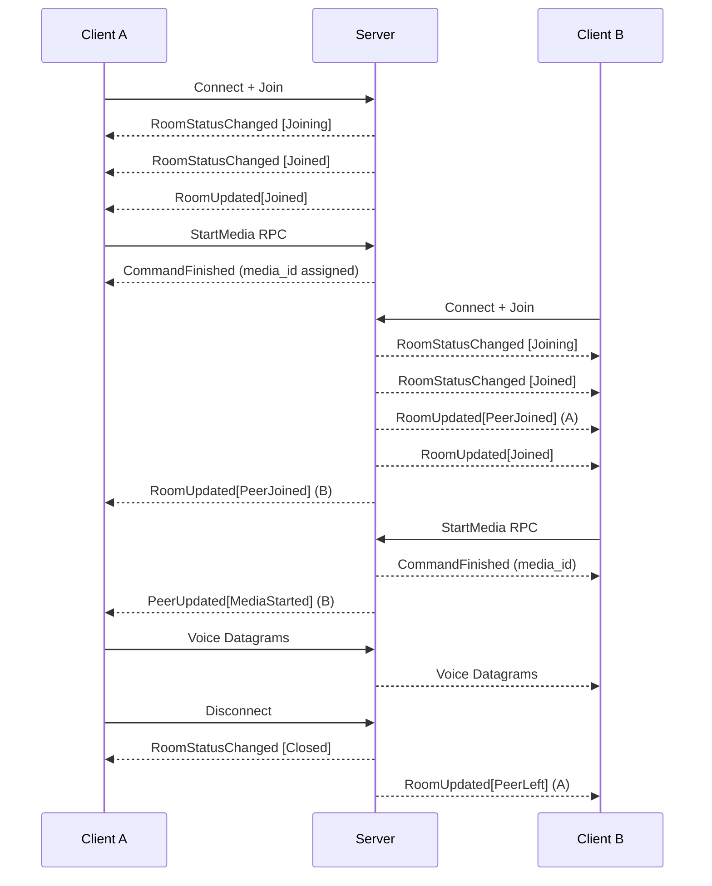

# ODIN Voice Core SDK 1.x (C/C++)

Low-level C API foundation for all ODIN Voice SDKs, enabling real-time voice chat integration.

> **Version Compatibility**: ODIN 1.x and 2.x are **not interoperable**. Clients using SDK 1.x cannot communicate with clients using SDK 2.x. Ensure all participants in a room use the same major version.

## Overview

The Core SDK is:
- **Built with Rust**, exposing a standard C API for cross-platform compatibility
- **Foundation for all platform SDKs** (Unity, Unreal, Web, Swift, NodeJS)
- **Event-driven architecture** using MessagePack-RPC for signaling
- **Explicit connection pooling** - you create and manage connection pools
- **JWT-based authentication** using Ed25519 key pairs
- **Advanced audio pipeline** with Opus codec, VAD, APM, and custom effects
- **Proximity-based spatial audio** with server-side culling
- **Optional end-to-end encryption** with AES-256-GCM

## Supported Platforms

| Platform | x86_64 | aarch64 | x86 | armv7a |
|----------|--------|---------|-----|--------|
| Windows  | ✓      | ✓       | ✓   | —      |
| Linux    | ✓      | ✓       | ✓   | —      |
| macOS    | ✓      | ✓       | —   | —      |
| Android  | ✓      | ✓       | ✓   | ✓      |
| iOS      | ✓      | ✓       | —   | —      |

Console platforms (Xbox, PlayStation, Nintendo Switch) available upon request.

## Installation

**Repository**: https://github.com/4Players/odin-sdk

**Prerequisites**:
- CMake 3.10+
- C++17 compatible compiler (for examples)
- Git with LFS support

**Steps**:
```bash
git clone https://github.com/4Players/odin-sdk.git
cd odin-sdk
git lfs fetch
git lfs checkout
```

**Integration**:
1. Include headers from `include/` directory
2. Link against the ODIN library for your platform from `bin/`
3. Initialize with `odin_initialize(ODIN_VERSION)`

## Quick Start

```c
#include "odin.h"
#include <stdio.h>
#include <string.h>
#include <time.h>

void on_rpc(uint64_t room_ref, const uint8_t* bytes, uint32_t length, void* user_data) {
    // Parse MessagePack-RPC: [2, method_name, params]
    printf("RPC event received, length: %u\n", length);
}

void on_datagram(uint64_t room_ref, uint16_t media_id, const uint8_t* bytes,
                 uint32_t length, void* user_data) {
    // Push to decoder for the media stream identified by media_id
}

int main() {
    // 1. Initialize SDK
    odin_initialize(ODIN_VERSION);

    // 2. Create token generator (testing only - use server-side in production!)
    OdinTokenGenerator* generator = NULL;
    odin_token_generator_create(ACCESS_KEY, &generator);

    // 3. Build JWT claims and sign to get a token
    time_t now = time(NULL);
    char claims[256];
    snprintf(claims, sizeof(claims), "{\"rid\":\"my-room\",\"uid\":\"user-123\",\"nbf\":%ld,\"exp\":%ld}", now, now + 300);

    char token[1024];
    uint32_t token_len = sizeof(token);
    odin_token_generator_sign(generator, claims, token, &token_len);

    // 4. Create connection pool with callbacks
    OdinConnectionPoolSettings settings = {
        .on_datagram = on_datagram,
        .on_rpc = on_rpc,
        .user_data = NULL
    };
    OdinConnectionPool* pool = NULL;
    odin_connection_pool_create(&settings, &pool);

    // 5. Create and join room
    OdinRoom* room = NULL;
    int result = odin_room_create(
        pool,
        "https://gateway.odin.4players.io",
        token,
        &room
    );

    if (result < 0) {
        printf("Error: %s\n", odin_error_get_last_error());
        return 1;
    }

    // 6. Create encoder for local audio
    OdinEncoder* encoder = NULL;
    odin_encoder_create(48000, false, &encoder);

    // 7. Create decoder for remote audio (per media stream)
    OdinDecoder* decoder = NULL;
    odin_decoder_create(0, 48000, false, &decoder);  // media_id from PeerUpdated[MediaStarted]

    // ... main loop: push audio to encoder, pop datagrams, send to room ...
    // ... receive datagrams in callback, push to decoder, pop audio ...

    // 8. Cleanup
    odin_encoder_free(encoder);
    odin_decoder_free(decoder);
    odin_room_close(room);
    odin_room_free(room);
    odin_connection_pool_free(pool);
    odin_token_generator_free(generator);
    odin_shutdown();

    return 0;
}
```

## Architecture

```
┌─────────────────────────────────────────────────────────────┐
│                    Application Layer                        │
├─────────────────────────────────────────────────────────────┤
│  Callbacks: on_rpc (MessagePack), on_datagram (voice)       │
├─────────────────────────────────────────────────────────────┤
│              OdinConnectionPool                             │
│  ├─ Routes events to rooms                                  │
│  └─ Manages network connections                             │
├─────────────────────────────────────────────────────────────┤
│                    OdinRoom                                 │
│  ├─ Media Streams (identified by media_id)                  │
│  ├─ Encoders (local audio → network)                        │
│  │   └─ Pipeline [VAD → APM → Custom] → Opus                │
│  └─ Decoders (network → playback audio)                     │
│      └─ Pipeline [Custom] ← Opus                            │
├─────────────────────────────────────────────────────────────┤
│         UDP Transport + RPC Signaling (MessagePack)         │
├─────────────────────────────────────────────────────────────┤
│     Optional Cipher (End-to-End Encryption)                 │
└─────────────────────────────────────────────────────────────┘
```

## Core API Reference

### Initialization & Shutdown

```c
// Initialize SDK - call once at startup
// version: Use ODIN_VERSION constant
int odin_initialize(const char* version);

// Shutdown SDK - cleanup all resources
void odin_shutdown();
```

### Error Handling

```c
// Get last error message (thread-local)
const char* odin_error_get_last_error();

// Clear error buffer
void odin_error_reset_last_error();
```

**Error Codes**: Negative values indicate errors, 0 = success, 1 = no data available.

### Token Generation

> **Security**: Access keys are sensitive credentials. Generate tokens server-side in production. Only use client-side token generation for testing.

```c
// Create token generator from access key (pass NULL to generate a new key)
int odin_token_generator_create(
    const char* access_key,
    OdinTokenGenerator** out_generator
);

// Get the access key from a generator (useful if you passed NULL above)
int odin_token_generator_get_access_key(
    OdinTokenGenerator* generator,
    char* out_access_key,
    uint32_t* out_length
);

// Get the public key (for server-side verification)
int odin_token_generator_get_public_key(
    OdinTokenGenerator* generator,
    char* out_public_key,
    uint32_t* out_length
);

// Get the key ID (embedded in tokens)
int odin_token_generator_get_key_id(
    OdinTokenGenerator* generator,
    char* out_key_id,
    uint32_t* out_length
);

// Sign JWT claims to produce a token
// body: JSON string containing claims (rid, uid, cid, exp, nbf)
// out_token: Buffer to receive the signed JWT
int odin_token_generator_sign(
    OdinTokenGenerator* generator,
    const char* body,
    char* out_token,
    uint32_t* out_token_length
);

// Free token generator
void odin_token_generator_free(OdinTokenGenerator* generator);
```

**JWT Claims** (input to `odin_token_generator_sign`):
```json
{
    "rid": "room-name",
    "uid": "user-identifier",
    "nbf": 1735603200,
    "exp": 1735689600
}
```

| Claim | Description                                          |
| ----- | ---------------------------------------------------- |
| `rid` | Room ID - which room to join                         |
| `uid` | User ID - application-defined identifier             |
| `nbf` | Not Before - Unix timestamp when token becomes valid |
| `exp` | Expiration - Unix timestamp when token expires       |

### Connection Pool

The connection pool manages network connections and routes events for one or more rooms.

```c
// Callback for voice datagrams
typedef void (*OdinDatagramCallback)(
    uint64_t room_ref,          // Room handle ID
    uint16_t media_id,          // Sender's media stream ID
    const uint8_t* bytes,       // Encoded Opus audio
    uint32_t bytes_length,
    void* user_data
);

// Callback for RPC events (MessagePack)
typedef void (*OdinRpcCallback)(
    uint64_t room_ref,          // Room handle ID
    const uint8_t* bytes,       // MessagePack-RPC data
    uint32_t bytes_length,
    void* user_data
);

// Connection pool settings
typedef struct OdinConnectionPoolSettings {
    OdinDatagramCallback on_datagram;
    OdinRpcCallback on_rpc;
    void* user_data;
} OdinConnectionPoolSettings;

// Create connection pool
int odin_connection_pool_create(
    const OdinConnectionPoolSettings* settings,
    OdinConnectionPool** out_pool
);

// Free connection pool
void odin_connection_pool_free(OdinConnectionPool* pool);
```

### Room Management

```c
// Create and connect to room (basic)
int odin_room_create(
    OdinConnectionPool* pool,
    const char* uri,             // e.g., "https://gateway.odin.4players.io"
    const char* token,           // Signed JWT
    OdinRoom** out_room
);

// Create and connect to room (extended)
int odin_room_create_ex(
    OdinConnectionPool* pool,
    const char* uri,
    const char* token,
    const char* room_name,       // Room name (can differ from token's rid)
    const uint8_t* user_data,    // Custom binary metadata
    uint32_t user_data_length,
    const float position[3],     // Initial 3D position [x, y, z]
    OdinCipher* cipher,          // Optional E2EE cipher (NULL to disable)
    OdinRoom** out_room
);

// Disconnect from room
int odin_room_close(OdinRoom* room);

// Free room resources
void odin_room_free(OdinRoom* room);

// Get room reference handle (used in callbacks)
uint64_t odin_room_get_ref(OdinRoom* room);

// Get room name
int odin_room_get_name(OdinRoom* room, char* buffer, uint32_t* buffer_size);

// Get connection ID (32-bit)
uint32_t odin_room_get_connection_id(OdinRoom* room);

// Get connection statistics
int odin_room_get_connection_stats(OdinRoom* room, OdinConnectionStats* stats);

// Send RPC command (MessagePack)
int odin_room_send_rpc(OdinRoom* room, const uint8_t* bytes, uint32_t length);

// Send voice datagram
int odin_room_send_datagram(OdinRoom* room, const uint8_t* bytes, uint32_t length);
```

**Connection Statistics**:
```c
typedef struct OdinConnectionStats {
    uint64_t udp_tx_datagrams;
    uint64_t udp_tx_bytes;
    float udp_tx_loss;            // Percentage

    uint64_t udp_rx_datagrams;
    uint64_t udp_rx_bytes;
    float udp_rx_loss;            // Percentage

    uint64_t cwnd;                // Congestion window
    uint64_t congestion_events;
    float rtt;                    // Round-trip time (ms)
} OdinConnectionStats;
```

### Encoders (Local Audio)

Encoders process local audio input (microphone), apply effects, encode with Opus, and produce datagrams for transmission.

The `sample_rate` and `stereo` parameters describe the format of audio you will push to the encoder. ODIN resamples internally, so you don't need to convert your audio to match Opus's native rates.

```c
// Create encoder
// sample_rate: Sample rate of audio you will provide (e.g., 44100, 48000)
// stereo: Channel layout you will provide (true = stereo, false = mono)
int odin_encoder_create(
    uint32_t sample_rate,
    bool stereo,
    OdinEncoder** out_encoder
);

// Extended creation with codec options
int odin_encoder_create_ex(
    uint32_t sample_rate,
    bool stereo,
    bool voip_application,           // Optimize for voice (true) or music (false)
    uint32_t bitrate_kbps,           // Target bitrate
    uint8_t packet_loss_percentage,  // Expected packet loss for FEC
    OdinEncoder** out_encoder
);

// Push audio samples to encoder
// samples: Interleaved float samples [-1.0, 1.0]
int odin_encoder_push(OdinEncoder* encoder, const float* samples, uint32_t sample_count);

// Pop encoded datagram (call in loop until returns ODIN_ERROR_NO_DATA)
// media_ids: Array of media IDs to target (up to 4)
// media_ids_count: Number of media IDs
// Returns: ODIN_ERROR_SUCCESS = datagram available, ODIN_ERROR_NO_DATA = no more data
int odin_encoder_pop(
    OdinEncoder* encoder,
    const uint16_t* media_ids,
    uint32_t media_ids_count,
    uint8_t* buffer,
    uint32_t* length
);

// Check if encoder output is silent (VAD detected silence)
bool odin_encoder_is_silent(OdinEncoder* encoder);

// Get audio pipeline for effects
const OdinPipeline* odin_encoder_get_pipeline(OdinEncoder* encoder);

// Set event callback for encoder state changes
int odin_encoder_set_event_callback(
    OdinEncoder* encoder,
    int32_t event_filter,    // ODIN_AUDIO_EVENTS_* flags
    OdinAudioEventCallback callback,
    void* user_data
);

// Free encoder
void odin_encoder_free(OdinEncoder* encoder);
```

### Decoders (Remote Audio)

Decoders receive voice datagrams from remote peers, decode Opus audio, and produce playback samples. Create one decoder per remote media stream.

```c
// Create decoder
// media_id: The media stream ID (from PeerUpdated[MediaStarted] event)
// sample_rate: Sample rate you want to receive (e.g., 44100, 48000)
// stereo: Channel layout you want (true = stereo, false = mono)
int odin_decoder_create(
    uint16_t media_id,
    uint32_t sample_rate,
    bool stereo,
    OdinDecoder** out_decoder
);

// Extended creation with jitter buffer config
int odin_decoder_create_ex(
    uint16_t media_id,
    uint32_t sample_rate,
    bool stereo,
    uint8_t base_jitter_packets,     // Jitter buffer size in 20ms units
    OdinDecoder** out_decoder
);

// Push received datagram to decoder
int odin_decoder_push(OdinDecoder* decoder, const uint8_t* data, uint32_t length);

// Pop decoded audio samples
// is_silent: Output flag indicating silence
int odin_decoder_pop(
    OdinDecoder* decoder,
    float* samples,
    uint32_t sample_count,
    bool* is_silent
);

// Check if decoder output is silent
bool odin_decoder_is_silent(OdinDecoder* decoder);

// Get audio pipeline for effects
const OdinPipeline* odin_decoder_get_pipeline(OdinDecoder* decoder);

// Get jitter buffer statistics
int odin_decoder_get_jitter_stats(OdinDecoder* decoder, OdinDecoderJitterStats* stats);

// Set event callback
int odin_decoder_set_event_callback(
    OdinDecoder* decoder,
    int32_t event_filter,
    OdinAudioEventCallback callback,
    void* user_data
);

// Free decoder
void odin_decoder_free(OdinDecoder* decoder);
```

**Jitter Statistics**:
```c
typedef struct OdinDecoderJitterStats {
    uint32_t packets_total;
    uint32_t packets_buffered;
    uint32_t packets_processed;
    uint32_t packets_arrived_too_early;
    uint32_t packets_arrived_too_late;
    uint32_t packets_dropped;
    uint32_t packets_invalid;
    uint32_t packets_repeated;
    uint32_t packets_lost;
} OdinDecoderJitterStats;
```

### Audio Pipeline & Effects

The pipeline is a thread-safe effect chain that processes audio. Get it from encoder or decoder.

```c
// Get effect count
uint32_t odin_pipeline_get_effect_count(const OdinPipeline* pipeline);

// Insert Voice Activity Detection
int odin_pipeline_insert_vad_effect(
    const OdinPipeline* pipeline,
    uint32_t index,
    uint32_t* out_effect_id
);

// Configure VAD / Volume Gate
typedef struct OdinSensitivityConfig {
    bool enabled;
    float attack_threshold;
    float release_threshold;
} OdinSensitivityConfig;

typedef struct OdinVadConfig {
    OdinSensitivityConfig voice_activity;  // attack/release in percent (0.0 - 1.0)
    OdinSensitivityConfig volume_gate;     // attack/release in dBFS  (-90.0 - 0.0)
} OdinVadConfig;

int odin_pipeline_get_vad_config(const OdinPipeline* pipeline, uint32_t effect_id, OdinVadConfig* config);
int odin_pipeline_set_vad_config(const OdinPipeline* pipeline, uint32_t effect_id, const OdinVadConfig* config);

// Insert Audio Processing Module
int odin_pipeline_insert_apm_effect(
    const OdinPipeline* pipeline,
    uint32_t index,
    uint32_t playback_sample_rate,
    bool playback_stereo,
    uint32_t* out_effect_id
);

// Configure APM
typedef struct OdinApmConfig {
    bool echo_canceller;                                // Requires playback loopback
    bool high_pass_filter;                              // Remove low frequencies
    bool transient_suppressor;                          // Keyboard click detection
    OdinNoiseSuppressionLevel noise_suppression_level;  // None/Low/Moderate/High/VeryHigh
    OdinGainControllerVersion gain_controller_version;  // Disabled/V1/V2
} OdinApmConfig;

int odin_pipeline_get_apm_config(const OdinPipeline* pipeline, uint32_t effect_id, OdinApmConfig* config);
int odin_pipeline_set_apm_config(const OdinPipeline* pipeline, uint32_t effect_id, const OdinApmConfig* config);

// Feed playback audio for echo cancellation
int odin_pipeline_update_apm_playback(
    const OdinPipeline* pipeline,
    uint32_t effect_id,
    const float* samples,
    uint32_t sample_count,
    uint32_t delay_ms
);

// Insert custom effect
typedef void (*OdinCustomEffectCallback)(
    float* samples,
    uint32_t sample_count,
    bool* is_silent,
    const void* user_data
);

int odin_pipeline_insert_custom_effect(
    const OdinPipeline* pipeline,
    uint32_t index,
    OdinCustomEffectCallback callback,
    void* user_data,
    uint32_t* out_effect_id
);

// Pipeline management
int odin_pipeline_get_effect_id(const OdinPipeline* pipeline, uint32_t index, uint32_t* out_id);
int odin_pipeline_get_effect_index(const OdinPipeline* pipeline, uint32_t effect_id, uint32_t* out_index);
int odin_pipeline_get_effect_type(const OdinPipeline* pipeline, uint32_t effect_id, OdinEffectType* out_type);
int odin_pipeline_move_effect(const OdinPipeline* pipeline, uint32_t effect_id, uint32_t new_index);
int odin_pipeline_remove_effect(const OdinPipeline* pipeline, uint32_t effect_id);
```

**Noise Suppression Levels**:
```c
enum OdinNoiseSuppressionLevel {
    ODIN_NOISE_SUPPRESSION_LEVEL_NONE,        // Disabled
    ODIN_NOISE_SUPPRESSION_LEVEL_LOW,         // 6 dB reduction
    ODIN_NOISE_SUPPRESSION_LEVEL_MODERATE,    // 12 dB reduction
    ODIN_NOISE_SUPPRESSION_LEVEL_HIGH,        // 18 dB reduction
    ODIN_NOISE_SUPPRESSION_LEVEL_VERY_HIGH    // 21 dB reduction
};
```

**Gain Controller Versions**:
```c
enum OdinGainControllerVersion {
    ODIN_GAIN_CONTROLLER_VERSION_NONE,  // Disabled
    ODIN_GAIN_CONTROLLER_VERSION_V1,    // Adaptive digital gain + limiter (legacy)
    ODIN_GAIN_CONTROLLER_VERSION_V2     // Improved digital + input volume control
};
```

### End-to-End Encryption

Optional encryption for voice data, messages, and user data.

```c
#include "odin_crypto.h"

// Create cipher
// version: Use ODIN_CRYPTO_VERSION constant
OdinCipher* odin_crypto_create(const char* version);

// Set encryption password
int odin_crypto_set_password(OdinCipher* cipher, const uint8_t* password, uint32_t length);

// Check peer encryption status
enum OdinCryptoPeerStatus {
    ODIN_CRYPTO_PEER_PASSWORD_MISMATCH,
    ODIN_CRYPTO_PEER_UNKNOWN,
    ODIN_CRYPTO_PEER_UNENCRYPTED,
    ODIN_CRYPTO_PEER_ENCRYPTED
};

OdinCryptoPeerStatus odin_crypto_get_peer_status(OdinCipher* cipher, uint32_t peer_id);

// Free cipher
void odin_crypto_free(OdinCipher* cipher);
```

**Cryptographic Details**:
- Algorithm: AES-256-GCM (authenticated encryption)
- Key Derivation: PBKDF2-SHA256 with 600,000 iterations
- Key Rotation: After 1M packets or 2 GiB traffic

## RPC Events (MessagePack-RPC)

Events arrive as MessagePack-RPC in the `on_rpc` callback with format: `[2, method_name, params]`

### Event Flow



**Key points**:
- `RoomStatusChanged` events are synthetic (local)
- `RoomUpdated[Joined]` contains your `own_peer_id` and assigned `media_ids`
- You must send `StartMedia` RPC to begin transmitting
- `PeerUpdated[MediaStarted]` tells you when to create decoders
- Voice datagrams flow through `on_datagram`, not `on_rpc`

### Lifecycle Events

**RoomStatusChanged** (synthetic, local):
```
method: "RoomStatusChanged"
params: {status: "Joining" | "Joined" | "Closed", message: "..."}
```

**RoomUpdated[Joined]**:
```
method: "RoomUpdated"
params: {
    Joined: {
        room: "room-name",
        media_ids: [1, 2],           // Your assigned media stream IDs
        own_peer_id: 42,
        peers: [...]                 // Existing peers in room
    }
}
```

**RoomUpdated[Left]**:
```
method: "RoomUpdated"
params: {
    Left: {
        reason: "room_closing" | "server_closing" | "peer_kicked"
    }
}
```

### Peer Events

**RoomUpdated[PeerJoined]**:
```
method: "RoomUpdated"
params: {
    PeerJoined: {
        peer: {
            peer_id: 17,
            user_id: "player-abc",
            user_data: <binary>,
            tags: ["foo"]
        }
    }
}
```

**RoomUpdated[PeerLeft]**:
```
method: "RoomUpdated"
params: {
    PeerLeft: {
        peer_id: 17
    }
}
```

**PeerUpdated[UserDataChanged]**:
```
method: "PeerUpdated"
params: {
    UserDataChanged: {
        peer_id: 17,
        user_data: <binary>
    }
}
```

### Media Events

**PeerUpdated[MediaStarted]**:
```
method: "PeerUpdated"
params: {
    MediaStarted: {
        peer_id: 17,
        media: {
            media_id: 3,
            properties: {...}
        }
    }
}
```

**PeerUpdated[MediaStopped]**:
```
method: "PeerUpdated"
params: {
    MediaStopped: {
        peer_id: 17,
        media_id: 3
    }
}
```

### Data Events

**MessageReceived**:
```
method: "MessageReceived"
params: {
    sender_peer_id: 17,
    message: <binary or object>
}
```

### Command Response

**CommandFinished** (response to RPC commands):
```
[1, msg_id, error, result]
```
- `msg_id`: Matches your request
- `error`: null on success, error object on failure
- `result`: Command-specific response data

## RPC Commands

Send commands via `odin_room_send_rpc()` using MessagePack-RPC format: `[0, msg_id, method, params]`

### Start Media

Signal intent to transmit audio:
```
[0, 1, "StartMedia", {properties: {...}}]
```

Response includes assigned `media_id`.

### Stop Media

Stop transmitting on a media stream:
```
[0, 2, "StopMedia", {media_id: 3}]
```

### Send Message

Send arbitrary data to peers:
```
[0, 3, "SendMessage", {
    message: <binary>,
    peer_ids: [17, 23]      // Omit to broadcast
}]
```

### Update Peer

Update your user data:
```
[0, 4, "UpdatePeer", {
    user_data: <binary>
}]
```

### Set Peer Position

Update your 3D position for proximity chat:
```
[0, 5, "SetPeerPosition", {
    position: [10.0, 0.0, 5.0]
}]
```

## Proximity Chat

ODIN supports server-side voice culling based on 3D positions.

### Setting Position

Set initial position at room creation:
```c
float position[3] = {10.0f, 0.0f, 5.0f};
odin_room_create_ex(pool, uri, token, room_name,
                    user_data, user_data_len,
                    position,
                    NULL, &room);
```

Update position at runtime via RPC:
```c
// Build MessagePack: [0, msg_id, "SetPeerPosition", {position: [x, y, z]}]
uint8_t msgpack[64];
uint32_t len = build_set_position_rpc(msgpack, x, y, z);
odin_room_send_rpc(room, msgpack, len);
```

### Culling Behavior

- Server uses **unit sphere** (radius 1.0) for proximity culling
- Peers beyond this range stop receiving each other's voice packets
- Scale your world coordinates accordingly
- Reduces bandwidth and CPU for large rooms

## Common Patterns

### Audio Processing Loop

```c
// Capture thread
void capture_thread(OdinEncoder* encoder, OdinRoom* room, uint16_t media_id) {
    float samples[960];  // 20ms at 48kHz
    uint8_t datagram[2048];
    uint32_t datagram_len;
    uint16_t media_ids[1] = {media_id};

    while (running) {
        // Capture from microphone
        capture_microphone(samples, 960);

        // Push to encoder
        odin_encoder_push(encoder, samples, 960);

        // Pop and send all available datagrams
        datagram_len = sizeof(datagram);
        while (odin_encoder_pop(encoder, media_ids, 1, datagram, &datagram_len) == 0) {
            odin_room_send_datagram(room, datagram, datagram_len);
            datagram_len = sizeof(datagram);
        }
    }
}

// Playback thread
void playback_thread(OdinDecoder* decoder) {
    float samples[960];
    bool is_silent;

    while (running) {
        odin_decoder_pop(decoder, samples, 960, &is_silent);
        if (!is_silent) {
            playback_audio(samples, 960);
        }
    }
}
```

### Event Handling

```c
#include <msgpack.h>

void on_rpc(uint64_t room_ref, const uint8_t* bytes, uint32_t length, void* user_data) {
    // Parse MessagePack-RPC
    msgpack_unpacked msg;
    msgpack_unpacked_init(&msg);

    if (msgpack_unpack_next(&msg, (char*)bytes, length, NULL) != MSGPACK_UNPACK_SUCCESS) {
        return;
    }

    msgpack_object* arr = &msg.data;
    if (arr->type != MSGPACK_OBJECT_ARRAY || arr->via.array.size < 3) {
        msgpack_unpacked_destroy(&msg);
        return;
    }

    int type = arr->via.array.ptr[0].via.i64;

    if (type == 2) {  // Notification
        msgpack_object* method = &arr->via.array.ptr[1];
        msgpack_object* params = &arr->via.array.ptr[2];

        if (strncmp(method->via.str.ptr, "RoomUpdated", method->via.str.size) == 0) {
            handle_room_updated(params);
        } else if (strncmp(method->via.str.ptr, "PeerUpdated", method->via.str.size) == 0) {
            handle_peer_updated(params);
        } else if (strncmp(method->via.str.ptr, "MessageReceived", method->via.str.size) == 0) {
            handle_message(params);
        }
    }

    msgpack_unpacked_destroy(&msg);
}
```

### Media Stream Management

```c
typedef struct PeerState {
    uint64_t peer_id;
    uint16_t media_id;
    OdinDecoder* decoder;
} PeerState;

PeerState peers[MAX_PEERS];
int peer_count = 0;

void handle_peer_updated(msgpack_object* params) {
    // Check for MediaStarted
    // ...extract peer_id and media_id...

    // Create decoder for this media stream
    OdinDecoder* decoder;
    odin_decoder_create(media_id, 48000, false, &decoder);

    peers[peer_count++] = (PeerState){
        .peer_id = peer_id,
        .media_id = media_id,
        .decoder = decoder
    };
}

void on_datagram(uint64_t room_ref, uint16_t media_id, const uint8_t* bytes,
                 uint32_t length, void* user_data) {
    // Find decoder for this media stream
    for (int i = 0; i < peer_count; i++) {
        if (peers[i].media_id == media_id) {
            odin_decoder_push(peers[i].decoder, bytes, length);
            break;
        }
    }
}
```

### VAD and APM Setup

```c
OdinEncoder* encoder;
odin_encoder_create(48000, false, &encoder);

const OdinPipeline* pipeline = odin_encoder_get_pipeline(encoder);

// Add VAD
uint32_t vad_id;
odin_pipeline_insert_vad_effect(pipeline, 0, &vad_id);

OdinVadConfig vad_config = {
    .voice_activity = {.enabled = true, .attack_threshold = 0.9f, .release_threshold = 0.8f},
    .volume_gate = {.enabled = true, .attack_threshold = -30.0f, .release_threshold = -40.0f}
};
odin_pipeline_set_vad_config(pipeline, vad_id, &vad_config);

// Add APM
uint32_t apm_id;
odin_pipeline_insert_apm_effect(pipeline, 1, 48000, false, &apm_id);

OdinApmConfig apm_config = {
    .echo_canceller = true,
    .high_pass_filter = true,
    .transient_suppressor = true,
    .noise_suppression_level = ODIN_NOISE_SUPPRESSION_LEVEL_MODERATE,
    .gain_controller_version = ODIN_GAIN_CONTROLLER_VERSION_V2
};
odin_pipeline_set_apm_config(pipeline, apm_id, &apm_config);
```

### End-to-End Encryption

```c
#include "odin_crypto.h"

// Create cipher with password
OdinCipher* cipher = odin_crypto_create(ODIN_CRYPTO_VERSION);
const char* password = "shared-secret";
odin_crypto_set_password(cipher, (uint8_t*)password, strlen(password));

// Create room with encryption
float position[3] = {0, 0, 0};
OdinRoom* room;
odin_room_create_ex(pool, uri, token, room_name,
                    user_data, user_data_len,
                    position,
                    cipher,
                    &room);

// Check peer encryption status
OdinCryptoPeerStatus status = odin_crypto_get_peer_status(cipher, peer_id);
if (status == ODIN_CRYPTO_PEER_ENCRYPTED) {
    printf("Peer %u is encrypted\n", peer_id);
} else if (status == ODIN_CRYPTO_PEER_PASSWORD_MISMATCH) {
    printf("Peer %u has wrong password!\n", peer_id);
}
```

## Audio Format

- **Sample Format**: 32-bit float, range [-1.0, 1.0]
- **Channel Layout**: Interleaved (L, R, L, R, ...)
- **Processing Chunk**: 20ms internally (960 frames @ 48kHz)
- **Codec**: Opus (automatically resamples)
- **Channels**: Mono (1) or Stereo (2)
- **Recommended Rate**: 48 kHz

## Audio Events

```c
enum OdinAudioEvents {
    ODIN_AUDIO_EVENTS_IS_SILENT_CHANGED = 1,  // Silence state changed
    ODIN_AUDIO_EVENTS_ALL = -1
};

void audio_callback(OdinEncoder* encoder, OdinAudioEvents events, void* user_data) {
    if (events & ODIN_AUDIO_EVENTS_IS_SILENT_CHANGED) {
        bool is_silent = odin_encoder_is_silent(encoder);
        // Update talk indicator
    }
}

odin_encoder_set_event_callback(encoder, ODIN_AUDIO_EVENTS_ALL, audio_callback, NULL);
```

## Test Client

A complete command-line client is available in `test/` directory of the SDK repository.

**Build**:
```bash
cd odin-sdk/test
mkdir build && cd build
cmake ..
cmake --build .
```

**Usage**:
```bash
./odin_client -r <room_id> -k <access_key> -s <server_url>
./odin_client --audio-devices        # List audio devices
./odin_client --disable-vad          # Disable voice activity detection
./odin_client --disable-apm          # Disable audio processing
./odin_client --password <secret>    # Enable E2EE
```

## Best Practices

1. **Authentication**: Generate JWT tokens server-side in production
2. **Error Handling**: Always check return values and call `odin_error_get_last_error()`
3. **Audio Threading**: Use separate threads for capture and playback
4. **Resource Cleanup**: Free resources in reverse creation order
5. **Pipeline Effects**: Add VAD before APM in the pipeline
6. **Echo Cancellation**: Feed playback samples via `odin_pipeline_update_apm_playback()`
7. **Media Streams**: Create decoders only when `PeerUpdated[MediaStarted]` is received
8. **MessagePack**: Use a proper MessagePack library (msgpack-c, etc.)
9. **Proximity Chat**: Scale positions to unit sphere for server culling

## Migration to 2.x

Projects using SDK 1.x should plan migration to 2.x for new features and continued support:

| 1.x Concept                             | 2.x Equivalent                                       |
| --------------------------------------- | ---------------------------------------------------- |
| `OdinConnectionPool`                    | Implicit (removed)                                   |
| `odin_connection_pool_create()`         | Callbacks in `OdinRoomEvents`                        |
| `odin_room_create(pool, ...)`           | `odin_room_create(gateway, auth_json, &events, ...)` |
| MessagePack-RPC events                  | JSON events                                          |
| `media_id` concept                      | Removed (simpler encoder/decoder)                    |
| `StartMedia`/`StopMedia` RPC            | Not needed                                           |
| `odin_encoder_pop(..., media_ids, ...)` | `odin_encoder_pop(encoder, buf, &len)`               |
| `odin_decoder_create(media_id, ...)`    | `odin_decoder_create(rate, stereo, &dec)`            |
| `SetPeerPosition` RPC                   | `odin_encoder_set_position()`                        |
| Proximity culling only                  | 64-channel bitmask + positions                       |

## Documentation & Resources

- **GitHub Repository**: https://github.com/4Players/odin-sdk
- **API Documentation**: https://docs.4players.io/voice/core/
- **Platform SDKs**: Unity, Unreal, Web, Swift, NodeJS built on this Core SDK
