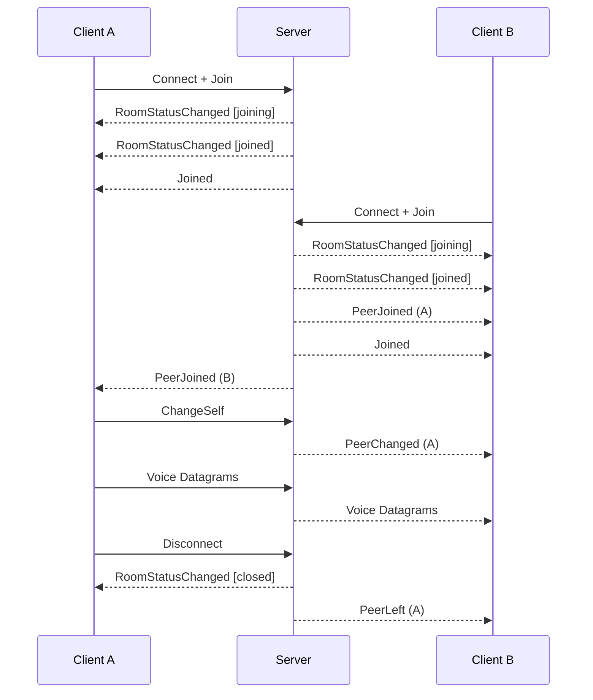

# ODIN Voice Core SDK 2.x (C/C++)

Low-level C API foundation for all ODIN Voice SDKs, enabling real-time voice chat integration.

> **Version Compatibility**: ODIN 1.x and 2.x are **not interoperable**. Clients using SDK 1.x cannot communicate with clients using SDK 2.x. Ensure all participants in a room use the same major version.

## Overview

The Core SDK is:
- **Built with Rust**, exposing a standard C API for cross-platform compatibility
- **Foundation for all platform SDKs** (Unity, Unreal, Web, Swift, NodeJS)
- **Event-driven architecture** using structured JSON for signaling
- **Implicit connection pooling** - no manual pool management required
- **JWT-based authentication** using Ed25519 key pairs
- **Advanced audio pipeline** with Opus codec, VAD, APM, and custom effects
- **Spatial audio** with 64-channel support and 3D positioning
- **Optional end-to-end encryption** with AES-256-GCM

## Supported Platforms

| Platform | x86_64 | aarch64 | x86 | armv7a |
|----------|--------|---------|-----|--------|
| Windows  | ✓      | ✓       | ✓   | —      |
| Linux    | ✓      | ✓       | ✓   | —      |
| macOS    | ✓      | ✓       | —   | —      |
| Android  | ✓      | ✓       | ✓   | ✓      |
| iOS      | ✓      | ✓       | —   | —      |

Console platforms (Xbox, PlayStation, Nintendo Switch) available upon request.

## Installation

**Repository**: https://github.com/4Players/odin-sdk

**Prerequisites**:
- CMake 3.10+
- C++17 compatible compiler (for examples)
- Git with LFS support

**Steps**:
```bash
git clone https://github.com/4Players/odin-sdk.git
cd odin-sdk
git lfs fetch
git lfs checkout
```

**Integration**:
1. Include headers from `include/` directory
2. Link against the ODIN library for your platform from `bin/`
3. Initialize with `odin_initialize(ODIN_VERSION)`

## Quick Start

```c
#include "odin.h"
#include <stdio.h>
#include <string.h>
#include <time.h>

void on_rpc(OdinRoom* room, const char* json, void* user_data) {
    printf("Event: %s\n", json);
}

void on_datagram(OdinRoom* room, const OdinDatagramProperties* props,
                 const uint8_t* data, uint32_t length, void* user_data) {
    // Push to decoder for the peer identified by props->peer_id
}

int main() {
    // 1. Initialize SDK
    odin_initialize(ODIN_VERSION);

    // 2. Create token generator (testing only - use server-side in production!)
    OdinTokenGenerator* generator = NULL;
    odin_token_generator_create(ACCESS_KEY, &generator);

    // 3. Build JWT claims and sign to get a token
    time_t now = time(NULL);
    char claims[256];
    snprintf(claims, sizeof(claims), "{\"rid\":\"my-room\",\"uid\":\"user-123\",\"nbf\":%ld,\"exp\":%ld}", now, now + 300);

    char token[1024];
    uint32_t token_len = sizeof(token);
    odin_token_generator_sign(generator, claims, token, &token_len);

    // 4. Build authentication JSON (token + optional user_data, channel_masks)
    char auth_json[2048];
    snprintf(auth_json, sizeof(auth_json), "{\"token\":\"%s\",\"user_data\":{\"name\":\"Player1\"}}", token);

    // 5. Set up event callbacks
    OdinRoomEvents events = {
        .on_datagram = on_datagram,
        .on_rpc = on_rpc,
        .user_data = NULL
    };

    // 6. Create and join room
    OdinRoom* room = NULL;
    int result = odin_room_create(
        "https://gateway.odin.4players.io",
        auth_json,
        &events,
        NULL,  // cipher (optional E2EE)
        &room
    );

    if (result < 0) {
        printf("Error: %s\n", odin_error_get_last_error());
        return 1;
    }

    // 7. Create encoder for local audio
    OdinEncoder* encoder = NULL;
    odin_encoder_create(0, 48000, false, &encoder);

    // 8. Create decoder for remote audio
    OdinDecoder* decoder = NULL;
    odin_decoder_create(48000, false, &decoder);

    // ... main loop: push audio to encoder, pop datagrams, send to room ...
    // ... receive datagrams in callback, push to decoder, pop audio ...

    // 9. Cleanup
    odin_encoder_free(encoder);
    odin_decoder_free(decoder);
    odin_room_close(room);
    odin_room_free(room);
    odin_token_generator_free(generator);
    odin_shutdown();

    return 0;
}
```

## Architecture

```
┌─────────────────────────────────────────────────────────────┐
│                    Application Layer                        │
├─────────────────────────────────────────────────────────────┤
│  Callbacks: on_rpc (JSON events), on_datagram (voice)       │
├─────────────────────────────────────────────────────────────┤
│                    OdinRoom                                 │
│  ├─ Encoders (local audio → network)                        │
│  │   └─ Pipeline [VAD → APM → Custom] → Opus                │
│  └─ Decoders (network → playback audio)                     │
│      └─ Pipeline [Custom] ← Opus                            │
├─────────────────────────────────────────────────────────────┤
│         Connection Pool (Implicit, Transparent)             │
│  ├─ UDP Transport (voice datagrams)                         │
│  └─ RPC Signaling (JSON events)                             │
├─────────────────────────────────────────────────────────────┤
│     Optional Cipher (End-to-End Encryption)                 │
└─────────────────────────────────────────────────────────────┘
```

## Core API Reference

### Initialization & Shutdown

```c
// Initialize SDK - call once at startup
// version: Use ODIN_VERSION constant
int odin_initialize(const char* version);

// Shutdown SDK - cleanup all resources
void odin_shutdown();
```

### Error Handling

```c
// Get last error message (thread-local)
const char* odin_error_get_last_error();

// Clear error buffer
void odin_error_reset_last_error();
```

**Error Codes**: Negative values indicate errors, 0 = success, 1 = no data available.

### Token Generation

> **Security**: Access keys are sensitive credentials. Generate tokens server-side in production. Only use client-side token generation for testing.

```c
// Create token generator from access key (pass NULL to generate a new key)
int odin_token_generator_create(
    const char* access_key,
    OdinTokenGenerator** out_generator
);

// Get the access key from a generator (useful if you passed NULL above)
int odin_token_generator_get_access_key(
    OdinTokenGenerator* generator,
    char* out_access_key,
    uint32_t* out_length
);

// Sign JWT claims to produce a token
// body: JSON string containing claims (rid, uid, exp, nbf)
// out_token: Buffer to receive the signed JWT
int odin_token_generator_sign(
    OdinTokenGenerator* generator,
    const char* body,
    char* out_token,
    uint32_t* out_token_length
);

// Free token generator
void odin_token_generator_free(OdinTokenGenerator* generator);
```

**JWT Claims** (input to `odin_token_generator_sign`):
```json
{
    "rid": "room-name",
    "uid": "user-identifier",
    "nbf": 1735603200,
    "exp": 1735689600
}
```

| Claim | Description                                          |
| ----- | ---------------------------------------------------- |
| `rid` | Room ID - which room to join                         |
| `uid` | User ID - application-defined identifier             |
| `nbf` | Not Before - Unix timestamp when token becomes valid |
| `exp` | Expiration - Unix timestamp when token expires       |

Advanced claims (rarely needed): `aud` (audience), `adr` (server address), `cid` (customer ID)

### Room Management

```c
// Event callback structure
typedef struct OdinRoomEvents {
    void (*on_datagram)(OdinRoom*, OdinDatagramProperties*, uint8_t*, uint32_t, void*);
    void (*on_rpc)(OdinRoom*, const char* json, void*);
    void* user_data;
} OdinRoomEvents;

// Create and connect to room
int odin_room_create(
    const char* gateway_url,         // e.g., "https://gateway.odin.4players.io"
    const char* authentication_json, // Token and optional user_data, channel_masks
    const OdinRoomEvents* events,    // Callbacks for events and datagrams
    OdinCipher* cipher,              // Optional E2EE cipher (NULL to disable)
    OdinRoom** out_room              // Output: room handle
);

// Disconnect from room
int odin_room_close(OdinRoom* room);

// Free room resources
void odin_room_free(OdinRoom* room);

// Get room name
int odin_room_get_name(OdinRoom* room, char* buffer, size_t buffer_size);

// Get connection ID (32-bit)
uint32_t odin_room_get_connection_id(OdinRoom* room);

// Get connection statistics
int odin_room_get_connection_stats(OdinRoom* room, OdinConnectionStats* stats);

// Send RPC command (JSON)
int odin_room_send_rpc(OdinRoom* room, const char* json_text);

// Send voice datagram
int odin_room_send_datagram(OdinRoom* room, const uint8_t* bytes, uint32_t length);

// Re-sync user data to all peers
int odin_room_resend_user_data(OdinRoom* room);
```

**Connection Statistics**:
```c
typedef struct OdinConnectionStats {
    uint64_t udp_tx_datagrams;
    uint64_t udp_tx_bytes;

    uint64_t udp_rx_datagrams;
    uint64_t udp_rx_bytes;

    float rtt;
} OdinConnectionStats;
```

**Authentication JSON** (input to `odin_room_create`):

The authentication parameter can be either a signed JWT string directly, or a JSON object:

```json
{
    "token": "<signed_jwt>",
    "room_id": "my-room",
    "user_data": {"name": "Player1", "team": "red"},
    "channel_masks": {
        "1": 21
    }
}
```

| Field           | Required | Description                                            |
| --------------- | -------- | ------------------------------------------------------ |
| `token`         | Yes      | The signed JWT from `odin_token_generator_sign`        |
| `room_id`       | No       | Room to join (if token contains multiple `rid` values) |
| `user_data`     | No       | Custom JSON metadata visible to all peers              |
| `channel_masks` | No       | Map of peer_id → channel bitmask (see Spatial Audio)   |

**Example with token generator** (C++):
```cpp
// 1. Build JWT claims
nlohmann::json claims = {
    {"rid", "my-room"},
    {"uid", "user-123"},
    {"nbf", time(nullptr)},
    {"exp", time(nullptr) + 300}
};

// 2. Sign to get JWT
char token[1024];
uint32_t token_len = sizeof(token);
odin_token_generator_sign(generator, claims.dump().c_str(), token, &token_len);

// 3. Build authentication JSON
nlohmann::json auth = {
    {"token", std::string(token, token_len)},
    {"user_data", {{"name", "Alice"}, {"team", "red"}}}
};

// 4. Create room
odin_room_create(gateway, auth.dump().c_str(), &events, nullptr, &room);
```

### Encoders (Local Audio)

Encoders process local audio input (microphone), apply effects, encode with Opus, and produce datagrams for transmission.

The `sample_rate` and `stereo` parameters describe the format of audio you will push to the encoder. ODIN resamples internally, so you don't need to convert your audio to match Opus's native rates - just provide samples in whatever format your audio capture uses.

```c
// Create encoder
// peer_id: Local peer ID (0 before joining)
// sample_rate: Sample rate of audio you will provide (e.g., 44100, 48000)
// stereo: Channel layout you will provide (true = stereo, false = mono)
int odin_encoder_create(
    uint32_t peer_id,
    uint32_t sample_rate,
    bool stereo,
    OdinEncoder** out_encoder
);

// Extended creation with more options
int odin_encoder_create_ex(
    uint32_t peer_id,
    uint32_t sample_rate,
    bool stereo,
    bool voip_application,           // Optimize for voice
    uint32_t bitrate_kbps,           // Target bitrate
    uint8_t packet_loss_percentage,  // Expected packet loss
    uint32_t position_update_interval_ms,
    OdinEncoder** out_encoder
);

// Push audio samples to encoder
// samples: Interleaved float samples [-1.0, 1.0]
int odin_encoder_push(OdinEncoder* encoder, const float* samples, uint32_t sample_count);

// Pop encoded datagram (call in loop until returns 1)
// Returns: 0 = datagram available, 1 = no more data, <0 = error
int odin_encoder_pop(OdinEncoder* encoder, uint8_t* buffer, uint32_t* length);

// Check if encoder output is silent (VAD detected silence)
bool odin_encoder_is_silent(OdinEncoder* encoder);

// Set 3D position for spatial audio
int odin_encoder_set_position(
    OdinEncoder* encoder,
    uint64_t channel_mask,
    OdinPosition position
);

// Clear position
int odin_encoder_clear_position(OdinEncoder* encoder, uint64_t channel_mask);

// Get audio pipeline for effects
const OdinPipeline* odin_encoder_get_pipeline(OdinEncoder* encoder);

// Set event callback for encoder state changes
int odin_encoder_set_event_callback(
    OdinEncoder* encoder,
    int32_t event_filter,    // ODIN_AUDIO_EVENTS_* flags
    OdinAudioEventCallback callback,
    void* user_data
);

// Free encoder
void odin_encoder_free(OdinEncoder* encoder);
```

### Decoders (Remote Audio)

Decoders receive voice datagrams from remote peers, decode Opus audio, and produce playback samples.

The `sample_rate` and `stereo` parameters describe the format you want to receive from the decoder. ODIN resamples internally to match your playback device's requirements.

```c
// Create decoder
// sample_rate: Sample rate you want to receive (e.g., 44100, 48000)
// stereo: Channel layout you want (true = stereo, false = mono)
int odin_decoder_create(
    uint32_t sample_rate,
    bool stereo,
    OdinDecoder** out_decoder
);

// Push received datagram to decoder
int odin_decoder_push(OdinDecoder* decoder, const uint8_t* data, uint32_t length);

// Pop decoded audio samples
// is_silent: Output flag indicating silence
int odin_decoder_pop(
    OdinDecoder* decoder,
    float* samples,
    uint32_t sample_count,
    bool* is_silent
);

// Get active channel bitmask
uint64_t odin_decoder_get_active_channels(OdinDecoder* decoder);

// Get 3D positions for channels
int odin_decoder_get_positions(
    OdinDecoder* decoder,
    uint64_t channel_mask,
    OdinPosition* positions,
    uint32_t* count
);

// Check if decoder output is silent
bool odin_decoder_is_silent(OdinDecoder* decoder);

// Get audio pipeline for effects
const OdinPipeline* odin_decoder_get_pipeline(OdinDecoder* decoder);

// Set event callback
int odin_decoder_set_event_callback(
    OdinDecoder* decoder,
    int32_t event_filter,
    OdinAudioEventCallback callback,
    void* user_data
);

// Free decoder
void odin_decoder_free(OdinDecoder* decoder);
```

### Audio Pipeline & Effects

The pipeline is a thread-safe effect chain that processes audio. Get it from encoder or decoder.

```c
// Get effect count
uint32_t odin_pipeline_get_effect_count(const OdinPipeline* pipeline);

// Insert Voice Activity Detection
int odin_pipeline_insert_vad_effect(
    const OdinPipeline* pipeline,
    uint32_t index,
    uint32_t* out_effect_id
);

// Configure VAD / Volume Gate
typedef struct OdinSensitivityConfig {
    bool enabled;
    float attack_threshold;
    float release_threshold;
} OdinSensitivityConfig;

typedef struct OdinVadConfig {
    OdinSensitivityConfig voice_activity;  // attack/release in percent (0.0 - 1.0)
    OdinSensitivityConfig volume_gate;     // attack/release in dBFS  (-90.0 - 0.0)
} OdinVadConfig;

int odin_pipeline_get_vad_config(const OdinPipeline* pipeline, uint32_t effect_id, OdinVadConfig* config);
int odin_pipeline_set_vad_config(const OdinPipeline* pipeline, uint32_t effect_id, const OdinVadConfig* config);

// Insert Audio Processing Module
int odin_pipeline_insert_apm_effect(
    const OdinPipeline* pipeline,
    uint32_t index,
    uint32_t playback_sample_rate,
    bool playback_stereo,
    uint32_t* out_effect_id
);

// Configure APM
typedef struct OdinApmConfig {
    bool echo_canceller;                                // Requires playback loopback
    bool high_pass_filter;                              // Remove low frequencies
    bool transient_suppressor;                          // Keyboard click detection
    OdinNoiseSuppressionLevel noise_suppression_level;  // None/Low/Moderate/High/VeryHigh
    OdinGainControllerVersion gain_controller_version;  // Disabled/V1/V2
} OdinApmConfig;

int odin_pipeline_get_apm_config(const OdinPipeline* pipeline, uint32_t effect_id, OdinApmConfig* config);
int odin_pipeline_set_apm_config(const OdinPipeline* pipeline, uint32_t effect_id, const OdinApmConfig* config);

// Feed playback audio for echo cancellation
int odin_pipeline_update_apm_playback(
    const OdinPipeline* pipeline,
    uint32_t effect_id,
    const float* samples,
    uint32_t sample_count,
    uint32_t delay_ms
);

// Insert custom effect
typedef void (*OdinCustomEffectCallback)(
    float* samples,
    uint32_t sample_count,
    bool* is_silent,
    const void* user_data
);

int odin_pipeline_insert_custom_effect(
    const OdinPipeline* pipeline,
    uint32_t index,
    OdinCustomEffectCallback callback,
    void* user_data,
    uint32_t* out_effect_id
);

// Pipeline management
int odin_pipeline_get_effect_id(const OdinPipeline* pipeline, uint32_t index, uint32_t* out_id);
int odin_pipeline_get_effect_index(const OdinPipeline* pipeline, uint32_t effect_id, uint32_t* out_index);
int odin_pipeline_get_effect_type(const OdinPipeline* pipeline, uint32_t effect_id, OdinEffectType* out_type);
int odin_pipeline_move_effect(const OdinPipeline* pipeline, uint32_t effect_id, uint32_t new_index);
int odin_pipeline_remove_effect(const OdinPipeline* pipeline, uint32_t effect_id);
```

**Noise Suppression Levels**:
```c
enum OdinNoiseSuppressionLevel {
    ODIN_NOISE_SUPPRESSION_LEVEL_NONE,        // Disabled
    ODIN_NOISE_SUPPRESSION_LEVEL_LOW,         // 6 dB reduction
    ODIN_NOISE_SUPPRESSION_LEVEL_MODERATE,    // 12 dB reduction
    ODIN_NOISE_SUPPRESSION_LEVEL_HIGH,        // 18 dB reduction
    ODIN_NOISE_SUPPRESSION_LEVEL_VERY_HIGH    // 21 dB reduction
};
```

**Gain Controller Versions**:
```c
enum OdinGainControllerVersion {
    ODIN_GAIN_CONTROLLER_VERSION_NONE,  // Disabled
    ODIN_GAIN_CONTROLLER_VERSION_V1,    // Adaptive digital gain + limiter (legacy)
    ODIN_GAIN_CONTROLLER_VERSION_V2     // Improved digital + input volume control
};
```

### End-to-End Encryption

Optional encryption for voice data, messages, and user data.

```c
#include "odin_crypto.h"

// Create cipher
// version: Use ODIN_CRYPTO_VERSION constant
OdinCipher* odin_crypto_create(const char* version);

// Set encryption password
int odin_crypto_set_password(OdinCipher* cipher, const uint8_t* password, uint32_t length);

// Check peer encryption status
enum OdinCryptoPeerStatus {
    ODIN_CRYPTO_PEER_PASSWORD_MISMATCH,
    ODIN_CRYPTO_PEER_UNKNOWN,
    ODIN_CRYPTO_PEER_UNENCRYPTED,
    ODIN_CRYPTO_PEER_ENCRYPTED
};

OdinCryptoPeerStatus odin_crypto_get_peer_status(OdinCipher* cipher, uint32_t peer_id);

// Free cipher
void odin_crypto_free(OdinCipher* cipher);
```

**Cryptographic Details**:
- Algorithm: AES-256-GCM (authenticated encryption)
- Key Derivation: PBKDF2-SHA256 with 600,000 iterations
- Key Rotation: After 1M packets or 2 GiB traffic

## RPC Events

Events arrive as JSON in the `on_rpc` callback with structure: `{"EventName": {...}}`

### Event Flow

Understanding event order is essential for building responsive applications:



**Key points**:
- `RoomStatusChanged` events arrive before `Joined`
- `PeerJoined` events for existing peers arrive *before* your `Joined` event
- `PeerJoined` for new peers arrives *after* your `Joined` event
- Voice datagrams flow through `on_datagram`, not `on_rpc`

### Lifecycle Events

**RoomStatusChanged** (synthetic, local):
```json
{"RoomStatusChanged": {"status": "joining"}}
{"RoomStatusChanged": {"status": "joined"}}
{"RoomStatusChanged": {"status": "closed", "message": "connection lost"}}
```

**Joined**:
```json
{"Joined": {"own_peer_id": 42, "room_id": "my-room", "customer": "org-name"}}
```

**Left**:
```json
{"Left": {"reason": "room_closing"}}
{"Left": {"reason": "server_closing"}}
{"Left": {"reason": "peer_kicked"}}
```

### Peer Events

**PeerJoined**:
```json
{
    "PeerJoined": {
        "peer_id": 17,
        "user_id": "player-abc",
        "user_data": {"name": "Alice"},
        "tags": ["foo"],
        "parameters": {"level": "5"}
    }
}
```

**PeerLeft**:
```json
{"PeerLeft": {"peer_id": 17}}
```

**PeerChanged**:
```json
{"PeerChanged": {"peer_id": 17, "user_data": {"name": "Alice", "status": "ready"}}}
```

### Data Events

**MessageReceived** (payload can be byte array or JSON object):
```json
{"MessageReceived": {"sender_peer_id": 17, "message": [104, 101, 108, 108, 111]}}
{"MessageReceived": {"sender_peer_id": 17, "message": {"type": "chat", "text": "Hello!"}}}
```

**NewReconnectToken**:
```json
{"NewReconnectToken": {"token": "<new_jwt>"}}
```

**Error**:
```json
{"Error": {"message": "error description"}}
```

## RPC Commands

Send commands via `odin_room_send_rpc()`.

### Send Message

```json
{
    "SendMessage": {
        "message": [104, 101, 108, 108, 111],
        "peer_ids": [17, 23]
    }
}
```

Omit `peer_ids` to broadcast to all peers. Messages are reliable, in-order, and not affected by proximity/channels.

### Update Self

```json
{
    "ChangeSelf": {
        "user_data": {"name": "Alice", "team": "red"},
        "parameters": {"level": "10"},
        "tags": ["premium", "verified"]
    }
}
```

### Set Channel Masks

```json
{
    "SetChannelMasks": {
        "masks": {"0": 0, "1234": 21},
        "reset": true
    }
}
```

- Key `"0"` = global/server mask
- Other keys = peer-specific masks
- `reset: true` replaces existing, `false` merges

## Spatial Audio & Channels

### Channel Masks

Each room supports 64 audio channels (bitmask). Peers only hear audio from channels in their mask.

**Set in authentication JSON**:
```json
{
    "token": "...",
    "channel_masks": {
        "1": 21
    }
}
```

The key is the peer_id whose audio you want to filter. Value `21` (binary `10101`) means you'll only hear that peer on channels 1, 3, and 5.

**Update dynamically via RPC**:
```c
odin_room_send_rpc(room, "{\"SetChannelMasks\": {\"masks\": {\"1\": 6}, \"reset\": true}}");
```

### 3D Positioning

```c
typedef struct OdinPosition {
    float x, y, z;
} OdinPosition;

// Set position when transmitting
OdinPosition pos = {10.0f, 0.0f, 5.0f};
odin_encoder_set_position(encoder, 0x01, pos);  // Channel 1

// Get positions from received audio
OdinPosition positions[64];
uint32_t count;
odin_decoder_get_positions(decoder, 0xFFFFFFFFFFFFFFFF, positions, &count);
```

**Proximity**: Server uses unit sphere (radius 1.0) for culling. Scale positions accordingly.

## Common Patterns

### Audio Processing Loop

```c
// Capture thread
void capture_thread(OdinEncoder* encoder, OdinRoom* room) {
    float samples[960];  // 20ms at 48kHz
    uint8_t datagram[2048];
    uint32_t datagram_len;

    while (running) {
        // Capture from microphone
        capture_microphone(samples, 960);

        // Push to encoder
        odin_encoder_push(encoder, samples, 960);

        // Pop and send all available datagrams
        while (odin_encoder_pop(encoder, datagram, &datagram_len) == 0) {
            odin_room_send_datagram(room, datagram, datagram_len);
        }
    }
}

// Playback thread
void playback_thread(OdinDecoder* decoder) {
    float samples[960];
    bool is_silent;

    while (running) {
        odin_decoder_pop(decoder, samples, 960, &is_silent);
        if (!is_silent) {
            playback_audio(samples, 960);
        }
    }
}
```

### Event Handling

```c
#include <string.h>

void on_rpc(OdinRoom* room, const char* json, void* user_data) {
    // Simple prefix matching (use proper JSON parser in production)
    if (strstr(json, "\"Joined\"")) {
        printf("Joined room!\n");
    } else if (strstr(json, "\"PeerJoined\"")) {
        printf("Peer joined: %s\n", json);
    } else if (strstr(json, "\"PeerLeft\"")) {
        printf("Peer left\n");
    } else if (strstr(json, "\"MessageReceived\"")) {
        printf("Message: %s\n", json);
    }
}
```

### VAD and APM Setup

```c
OdinEncoder* encoder;
odin_encoder_create(0, 48000, false, &encoder);

const OdinPipeline* pipeline = odin_encoder_get_pipeline(encoder);

// Add VAD
uint32_t vad_id;
odin_pipeline_insert_vad_effect(pipeline, 0, &vad_id);

OdinVadConfig vad_config = {
    .voice_activity = {.enabled = true, .attack_threshold = 0.9f, .release_threshold = 0.8f},
    .volume_gate = {.enabled = true, .attack_threshold = -30.0f, .release_threshold = -40.0f}
};
odin_pipeline_set_vad_config(pipeline, vad_id, &vad_config);

// Add APM
uint32_t apm_id;
odin_pipeline_insert_apm_effect(pipeline, 1, 48000, false, &apm_id);

OdinApmConfig apm_config = {
    .echo_canceller = true,
    .high_pass_filter = true,
    .transient_suppressor = true,
    .noise_suppression_level = ODIN_NOISE_SUPPRESSION_LEVEL_MODERATE,
    .gain_controller_version = ODIN_GAIN_CONTROLLER_VERSION_V2
};
odin_pipeline_set_apm_config(pipeline, apm_id, &apm_config);
```

### End-to-End Encryption

```c
#include "odin_crypto.h"

// Create cipher with password
OdinCipher* cipher = odin_crypto_create(ODIN_CRYPTO_VERSION);
const char* password = "shared-secret";
odin_crypto_set_password(cipher, (uint8_t*)password, strlen(password));

// Create room with encryption
OdinRoom* room;
odin_room_create(gateway, auth_json, &events, cipher, &room);

// Check peer encryption status
OdinCryptoPeerStatus status = odin_crypto_get_peer_status(cipher, peer_id);
if (status == ODIN_CRYPTO_PEER_ENCRYPTED) {
    printf("Peer %u is encrypted\n", peer_id);
} else if (status == ODIN_CRYPTO_PEER_PASSWORD_MISMATCH) {
    printf("Peer %u has wrong password!\n", peer_id);
}
```

## Audio Format

- **Sample Format**: 32-bit float, range [-1.0, 1.0]
- **Channel Layout**: Interleaved (L, R, L, R, ...)
- **Processing Chunk**: 20ms internally (960 frames @ 48kHz)
- **Codec**: Opus (automatically resamples)
- **Channels**: Mono (1) or Stereo (2)
- **Recommended Rate**: 48 kHz

### Streaming Audio (Timing)

ODIN processes audio internally in **20ms chunks**. When streaming audio (e.g., from a file or buffer), you must pace your input to match real-time playback. The following example demonstrates proper timing:

```cpp
// Audio buffer contains 32-bit float samples at 48kHz stereo
const int sample_rate = 48000;
const int channel_count = 2;
const int frames_per_20ms = sample_rate * 20 / 1000;           // 960 frames at 48kHz
const int samples_per_chunk = frames_per_20ms * channel_count; // 1920 samples for stereo

OdinEncoder* encoder;
odin_encoder_create(peer_id, sample_rate, channel_count == 2, &encoder);

// Stream the buffer in 20ms chunks
auto next_time = std::chrono::steady_clock::now();
for (size_t offset = 0; offset < audio_buffer_size; offset += samples_per_chunk) {
    size_t chunk_size = std::min(samples_per_chunk, audio_buffer_size - offset);
    odin_encoder_push(encoder, &audio_buffer[offset], chunk_size);

    // Pop and send encoded datagrams
    for (;;) {
        uint8_t datagram[2048];
        uint32_t datagram_length = sizeof(datagram);
        if (odin_encoder_pop(encoder, datagram, &datagram_length) != ODIN_ERROR_SUCCESS)
            break;
        odin_room_send_datagram(room, datagram, datagram_length);
    }

    // Pace to real-time using wall clock (self-corrects for processing overhead)
    next_time += std::chrono::milliseconds(20);
    std::this_thread::sleep_until(next_time);
}

odin_encoder_free(encoder);
```

**Key points**:
- Feed audio in 20ms chunks (e.g., 960 frames @ 48kHz mono, 1920 samples @ 48kHz stereo)
- Use wall-clock pacing (`sleep_until`) rather than fixed delays to self-correct for processing time
- For microphone input, your audio capture callback naturally provides correctly-timed chunks

## Audio Events

```c
enum OdinAudioEvents {
    ODIN_AUDIO_EVENTS_IS_SILENT_CHANGED = 1,  // Silence state changed
    ODIN_AUDIO_EVENTS_POSITIONS_CHANGED = 2,  // 3D positions updated
    ODIN_AUDIO_EVENTS_ALL = -1
};

void audio_callback(int32_t event_type, void* user_data) {
    if (event_type & ODIN_AUDIO_EVENTS_IS_SILENT_CHANGED) {
        // Update talk indicator
    }
}

odin_encoder_set_event_callback(encoder, ODIN_AUDIO_EVENTS_ALL, audio_callback, NULL);
```

## Test Client

A complete command-line client is available in `test/` directory of the SDK repository.

**Build**:
```bash
cd odin-sdk/test
mkdir build && cd build
cmake ..
cmake --build .
```

**Usage**:
```bash
./odin_client -r <room_id> -k <access_key> -s <server_url>
./odin_client --audio-devices        # List audio devices
./odin_client --disable-vad          # Disable voice activity detection
./odin_client --disable-apm          # Disable audio processing
./odin_client --password <secret>    # Enable E2EE
```

## Best Practices

1. **Authentication**: Generate JWT tokens server-side in production
2. **Error Handling**: Always check return values and call `odin_error_get_last_error()`
3. **Audio Threading**: Use separate threads for capture and playback
4. **Resource Cleanup**: Free resources in reverse creation order
5. **Pipeline Effects**: Add VAD before APM in the pipeline
6. **Echo Cancellation**: Feed playback samples via `odin_pipeline_update_apm_playback()`
7. **Spatial Audio**: Scale positions to unit sphere for proximity culling
8. **JSON Parsing**: Use a proper JSON library (nlohmann/json, cJSON, etc.)

## Documentation & Resources

- **GitHub Repository**: https://github.com/4Players/odin-sdk
- **API Documentation**: https://docs.4players.io/voice/core/
- **Platform SDKs**: Unity, Unreal, Web, Swift, NodeJS built on this Core SDK
